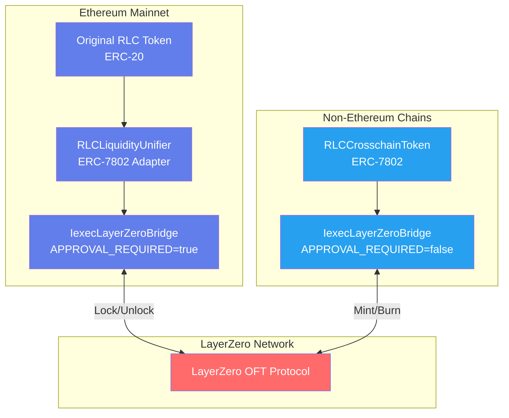

# RLC Multichain Bridge

This project implements a cross-chain token bridge system for the RLC token using LayerZero's OFT (Omnichain Fungible Token) protocol. It enables seamless token transfers between multiple blockchains, initially supporting Ethereum Sepolia and Arbitrum Sepolia testnets.

## Architecture

The system consists of three main components that work together to enable cross-chain RLC transfers:

### Core Components

1. **RLCCrosschainToken**: An upgradeable ERC20 token that implements the [ERC-7802](https://eips.ethereum.org/EIPS/eip-7802) bridgeable token standard. This token can be minted and burned by authorized bridge contracts and is deployed on non-Ethereum chains.

2. **RLCLiquidityUnifier** (Ethereum Mainnet only): A liquidity management contract that locks/unlocks the original RLC tokens on Ethereum. It implements the ERC-7802 interface to work seamlessly with bridge contracts while managing liquidity from the existing RLC token contract.

3. **IexecLayerZeroBridge**: A LayerZero OFT bridge contract that handles cross-chain messaging and token transfers. This contract has **dual deployment modes** based on the chain:
   - **Ethereum Mode** (`APPROVAL_REQUIRED = true`): Interfaces with RLCLiquidityUnifier to lock/unlock original RLC tokens
   - **Non-Ethereum Mode** (`APPROVAL_REQUIRED = false`): Directly mints/burns RLCCrosschainToken

### Deployment Architecture

The bridge system uses a **dual-mode architecture** where the same `IexecLayerZeroBridge` contract behaves differently based on deployment configuration:

#### **Ethereum Mainnet Deployment**
- **Configuration**: `APPROVAL_REQUIRED = true`
- **BRIDGEABLE_TOKEN**: Points to `RLCLiquidityUnifier` contract
- **Mechanism**: Lock/unlock original RLC tokens
- **Components**:
  - Original RLC Token (existing ERC-20)
  - `RLCLiquidityUnifier` (ERC-7802 wrapper/adapter)
  - `IexecLayerZeroBridge` (LayerZero bridge in Ethereum mode)

#### **Non-Ethereum Chain Deployment (L2s, Sidechains)**
- **Configuration**: `APPROVAL_REQUIRED = false`
- **BRIDGEABLE_TOKEN**: Points to `RLCCrosschainToken` contract
- **Mechanism**: Mint/burn bridgeable tokens
- **Components**:
  - `RLCCrosschainToken` (ERC-7802 bridgeable token)
  - `IexecLayerZeroBridge` (LayerZero bridge in non-Ethereum mode)

### Key Features

- **ERC-7802 Compatibility**: All bridgeable tokens implement the [ERC-7802](https://eips.ethereum.org/EIPS/eip-7802) standard
- **Dual-Mode Bridge**: Single bridge contract with different behaviors for Ethereum vs. non-Ethereum chains
- **Upgradeable Contracts**: UUPS proxy pattern for safe upgrades across all components
- **Dual-Pause Emergency System**: Granular control over bridge operations with complete and send-only pause modes
- **Multi-Chain Support**: Designed to extend to any LayerZero-supported chain
- **Original Token Preservation**: Maintains the original RLC token on Ethereum through liquidity management
- **Approval Optimization**: Smart approval handling for UI compatibility (e.g., Stargate)

### Architecture Flow



[](https://mermaid.live/edit#pako:eNqNVNtO4zAQ_RXLvAY2F3JpQEhpLrsPRUhQXqBoZRKXRjh2ZCdouf372nHSEhrYddV2MjnHZ-ZM4leYswLDED5wVG_AMllRIJdo73ViBdNmgzluK3CFa0ZKtIIaotblIr6VX7Bkj5ju0qflWXoZ2-bpj_LsbpeOClQ3mCtGH44oF9myT3_iLW5-p8tftwv0jPkN5gyktKhZSZseg2mhg73aI35fNny6dimnKpF_E-XL7H4R0eX8v4u4Fph3VasAMAoGG-_A4eHZmwWiuubsCQvQKHHxBkaWDPQObIMYESKAkBqfcP1FB3PAguWPuw1lc_ugY2kFLQSosBDoAb_15mqgjjucC2LOhDjMN6ikI7R0YYuWcYf2QIJJ-YT5h42lhRqnHFYgH5xLu3b1dT0qTweLhmnd7Rk56EQjJ_YU5mDecrpT2APEE91P9ZN82f2UV-lE919OKQPXlPx7Tj_BkiMq1mrTkWHbAvRvTpAQCV4DPLym65KQ8CD24izzDdFwSQ4PnMQ1576RM8J4eE9Q_njyiY-GV0Xz51bqZNmWb0eBnQXf8Vs1RM3NssSOzC03y4LANL_jkpeembjqs6u6WxPMD3xlnzE4N5jwUaAb_tDd6Mbgp7F9xlQTI4iestE_GuTlBBqwwrxCZSHPzFcFXUEpWuEVDGVY4DVqSaPOmXcJRW3Drp5pDkMpjg3Y1gVqcFIieUBVMFwjImS2RvSGsWoAyUsYvsI_MAysI8_yfNuZeY7tuUFgwGcYWjP3yLdN1_Jl5PiBab8b8KXbwDyaufbMOnYs27OsIPA8A3LWPmy2WrgoG8bP9ZnfHf2GPPpVN1qcy_cD85i1tJFKlj3UnHY8jXr_C5RA8AI)

### Token Standards & Bridge Architecture

The bridge system leverages modern token standards to enable secure cross-chain transfers:

- **ERC-7802 Bridgeable Token Standard**: A new standard that defines interfaces for tokens that can be minted and burned by authorized bridge contracts
- **LayerZero OFT V2**: Omnichain Fungible Token protocol for cross-chain messaging and token transfers
- **OpenZeppelin UUPS Proxy**: Upgradeable proxy pattern for contract evolution while maintaining state

### Supported Networks

Currently deployed on:
- **Ethereum Sepolia** (testnet)
- **Arbitrum Sepolia** (testnet)

The architecture is designed to support additional networks in the future with minimal changes.

## Prerequisites

- [Foundry](https://book.getfoundry.sh/getting-started/installation.html) for contract compilation and deployment
- Ethereum wallet with Sepolia ETH and Arbitrum Sepolia ETH for gas
- RLC tokens on Sepolia testnet for bridge testing
- [LCOV](https://wiki.documentfoundation.org/Development/Lcov) for coverage report generation (install via `brew install lcov` on macOS)

## Installation

1. Clone the repository

   ```bash
   git clone https://github.com/iExecBlockchainComputing/rlc-multichain.git
   cd rlc-multichain
   ```

2. Install dependencies

   ```bash
   forge install
   ```

3. Create a `.env` file

    ```sh
    cp .env.template .env # and edit .env content
    ```

**Note:** To run scripts, you must save a wallet in the Foundry keystore. Use the following command to import a wallet with a raw private key:

```bash
cast wallet import --private-key <RAW_PRIVATE_KEY> <ACCOUNT_NAME>
```

Alternatively, you can use a mnemonic by specifying the `--mnemonic-path` option. Remember the `<ACCOUNT_NAME>` you choose, and set it in your `.env` file under the `ACCOUNT` field.

## Contract Overview

The core contracts of the multichain bridge system:

- [RLCCrosschainToken.sol](src/RLCCrosschainToken.sol) - Bridgeable ERC20 token implementing ERC-7802 standard
- [RLCLiquidityUnifier.sol](src/RLCLiquidityUnifier.sol) - Liquidity management for original RLC tokens on Ethereum
- [IexecLayerZeroBridge.sol](src/bridges/layerZero/IexecLayerZeroBridge.sol) - LayerZero OFT bridge for cross-chain transfers

## 📊 Code Coverage Analysis

### Generating Coverage Reports

To generate and view the coverage report, run:

```bash
make generate-coverage
```

## Deployment

### Local deployment

1. Start a local Anvil fork of Sepolia:

   ```bash
   make fork-sepolia
   ```

2. Start a local fork of Arbitrum Sepolia:

   ```bash
   make fork-arbitrum-sepolia
   ```

3. Deploy all contracts:

   ```bash
   make deploy-on-anvil
   ```

### Live network deployment

   ```bash
   make deploy-on-testnets
   ```

## Upgrades

All core contracts (RLCCrosschainToken, RLCLiquidityUnifier, and IexecLayerZeroBridge) are implemented using the UUPS pattern, allowing for seamless contract upgrades while maintaining the same proxy address.

### Upgrade Architecture

- **UUPS Proxies**: Both contracts use OpenZeppelin's UUPS proxy pattern
- **Upgrade Authorization**: Only the contract owner can authorize upgrades
- **State Preservation**: Contract state is preserved across upgrades
- **Initialization**: New contract versions can include initialization logic for new features

### Upgrade Process

#### 1. Local Testing (Anvil)

Test upgrades locally before deploying to live networks:

```bash
# Test upgrade process on local forks
make upgrade-on-anvil
```

#### 2. Live Network Upgrades

Execute upgrades on testnets:

```bash
make upgrade-on-testnets
```

### Upgrade Safety Features

- **Storage Layout Protection**: Prevents storage slot conflicts between versions
- **Constructor Validation**: Ensures new implementations have compatible constructors
- **Manual Testing**: Always test upgrades thoroughly on testnets before deploying to mainnet

## Usage

### Bridge RLC

A. To send RLC tokens from Ethereum Sepolia to Arbitrum Sepolia:

```bash
make send-tokens-to-arbitrum-sepolia
```

This will:

1. Approve the RLCLiquidityUnifier to spend your RLC tokens
2. Initiate the cross-chain transfer through the IexecLayerZeroBridge
3. Lock original RLC tokens in the RLCLiquidityUnifier and mint equivalent RLCCrosschainToken on Arbitrum

B. To send RLC tokens from Arbitrum Sepolia back to Ethereum Sepolia:

```bash
make send-tokens-to-sepolia
```

This will:

1. Burn RLCCrosschainToken tokens on Arbitrum
2. Send a cross-chain message via LayerZero to Ethereum
3. Release the original RLC tokens from the RLCLiquidityUnifier on Ethereum

## How It Works

### Cross-Chain Transfer Mechanism

The bridge operates using different mechanisms depending on the source chain:

**Ethereum → Other Chains:**
1. User approves RLCLiquidityUnifier to spend original RLC tokens
2. RLCLiquidityUnifier locks the original RLC tokens  
3. IexecLayerZeroBridge sends a LayerZero message to the destination chain
4. Destination chain's IexecLayerZeroBridge receives the message and mints RLCCrosschainToken

**Other Chains → Ethereum:**
1. User initiates transfer from RLCCrosschainToken
2. Source chain's IexecLayerZeroBridge burns the RLCCrosschainToken
3. LayerZero delivers a message to Ethereum's IexecLayerZeroBridge
4. Ethereum's RLCLiquidityUnifier releases the original RLC tokens to the recipient

**Chain-to-Chain (Non-Ethereum):**
1. Source chain burns RLCCrosschainToken
2. LayerZero message triggers minting of RLCCrosschainToken on destination chain

This design ensures the total supply across all chains remains constant while preserving the original RLC token on Ethereum.


## Security Considerations

- The bridge security relies on LayerZero's security model
- Administrative functions are protected by the Ownable pattern
- UUPS upgrade authorization is restricted to contract owners only
- Use caution when setting trusted remotes to prevent unauthorized cross-chain interactions
- Always test upgrades thoroughly on testnets before deploying to mainnet
- Upgrade safety is enforced through OpenZeppelin's upgrade validation

## Emergency Controls: Dual-Pause System

The IexecLayerZeroBridge implements a sophisticated **dual-pause emergency system** designed to handle different types of security incidents while minimizing user impact.

### 🚨 Pause Levels

#### Level 1: Complete Pause (`pause()`)
**Use Case**: Critical security incidents requiring immediate complete shutdown
- **Blocks**: ❌ All bridge operations (incoming and outgoing transfers)
- **Allows**: ✅ Admin functions, view functions
- **Emergency**: Maximum protection - complete bridge shutdown

#### Level 2: Send Pause (`pauseSend()`)
**Use Case**: Destination chain issues, or controlled maintenance
- **Blocks**: ❌ Outgoing transfers only (users can't initiate send requests)
- **Allows**: ✅ Incoming transfers (users can still receive tokens from other chains)
- **Benefit**: Allows completion of in-flight transfers while preventing new ones

## Contract Verification

### Automatic Verification

Contracts are automatically verified on block explorers during deployment when using testnets:

```bash
# Deploys and verifies contracts on testnets
make deploy-on-testnets

# Upgrades and verifies contracts on testnets  
make upgrade-on-testnets
```

The verification is handled by Foundry's built-in `--verify` flag, which submits the source code and constructor arguments to the respective block explorers (Etherscan, Arbiscan, etc.).

## Gas Costs and Fees

LayerZero transactions require fees to cover:

1. Gas on the source chain
2. Gas on the destination chain (prepaid)
3. LayerZero relayer fees

The scripts automatically calculate these fees and include them in the transaction.

## Troubleshooting

## References

- [ERC-7802: Crosschain Token Interface](https://eips.ethereum.org/EIPS/eip-7802) - The crosschain token standard used by bridgeable tokens
- [LayerZero Documentation](https://layerzero.gitbook.io/docs/)
- [LayerZero OFT V2 Protocol](https://docs.layerzero.network/v2/developers/evm/oft/quickstart)
- [OpenZeppelin UUPS Proxy Pattern](https://docs.openzeppelin.com/contracts/5.x/api/proxy#UUPSUpgradeable)
- [OpenZeppelin Upgrade Safety](https://docs.openzeppelin.com/upgrades-plugins/1.x/writing-upgradeable)
- [Foundry Documentation](https://book.getfoundry.sh/)
- [Forge Coverage](https://book.getfoundry.sh/reference/forge/forge-coverage)
- [iExec Platform Documentation](https://docs.iex.ec/)

## TODO

- Use an entreprise RPC URL for `secrets.SEPOLIA_RPC_URL` in Github environment `ci`.
- Add git pre-commit hook to format code locally.
